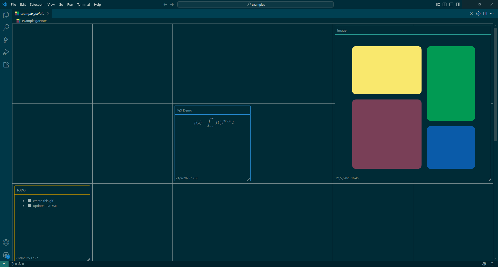

# VS Code Extension Grid Note

Reads `.gdNote` files (JSON inside), displays notes in a grid.

Currently 3 types of notes are offered, `markdown`(using [marked](https://marked.js.org/)), `TeX`(using [KaTeX](https://katex.org/)) and `image` (view local images [images can also be used within markdown])

Powered by [Svelte](https://svelte.dev/)

## Feedback welcome
